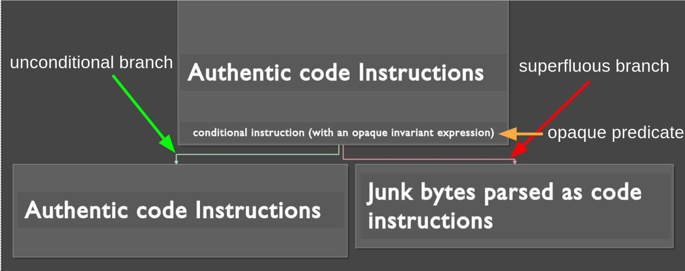

# 
 Opaque Predicates Detective 

## Introduction: 
Previous approaches to generically identify opaque predicates work by identifying if a conditional branch contains an invariant expression. Our approach generically identify opaque predicates from a different perspective: __the damage caused by the obfuscation__. The damage is localized at the basic block level (or at the function level) regardless of how an opaque predicate's invariant expression is constructed. This approach allows us to also detect an opaque predicate whose invariant expression is constructed across multiple processes! 

There are two main types of damage resulting from opaque predicates: code bloat or disassembly desynchronization. __Current implementation focuses on detecting opaque predicates when the damage is disassembly desynchronization__. Disassembly desynchronization is a umbrella term for obfuscation techniques that disrupt static disassembly by the creative placement of junk bytes (random data bytes) into the instruction stream such that a disassembler will parse those junk bytes as code instructions. In the case of an opaque predicate, junk bytes are inserted into the target basic block of the opaque predicate's superfluous branch. To identify junk bytes introduced by opaque predicates, we analyze each conditional branch's outgoing basic blocks for __illogical behaviors__ (which can manifest from code instructions that are actually junk bytes).

IDA also detects opaque predicates from the damage but its approach cannot identify the exact superfluous branch, and [the heuristic it uses allows the creation of stealthier opaque predicates](https://github.com/yellowbyte/analysis-of-anti-analysis/blob/develop/research/the_return_of_disassembly_desynchronization/the_return_of_disassembly_desynchronization.md).

Future work will look into detecting opaque predicates when the damage is code bloat.

## Detective in Action:
Current implementation is a [BinaryNinja](https://binary.ninja) plugin.

(insert YouTube link soon)

Note that the printed virtual addresses in the video are the target addresses of the superfluous branches. (The addresses can easily be changed to the addresses of the opaque conditional statements if desired.)

## Paper

(to be updated)

Authors: Yu-Jye Tung, Ian G. Harris
